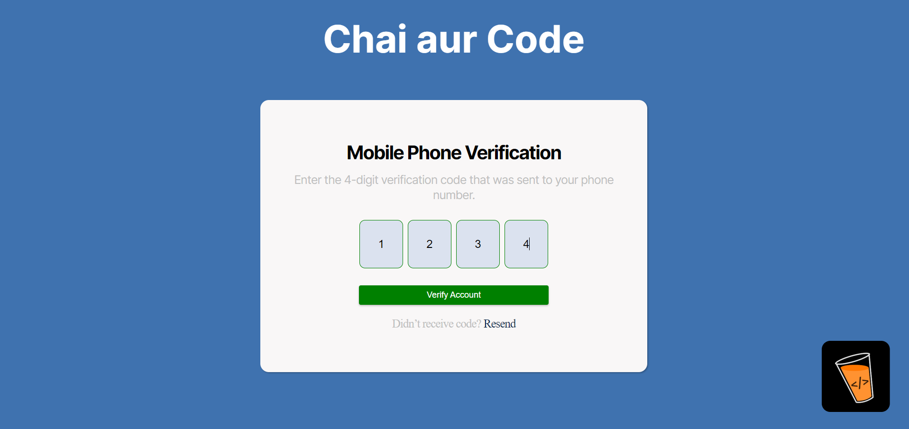

## Run Locally

Clone the project

```bash
  git clone https://link-to-project
```

Go to the project directory

```bash
  cd my-project
```

Install dependencies

```bash
  npm install
```

Start the server

```bash
  npm run dev
```


## Screenshots
OTP Form 


Drag and Drop Course Cards


Data Table


Project Live Link:[ Click Here](https://chaiassement1.netlify.app/) 

